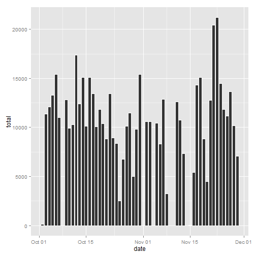
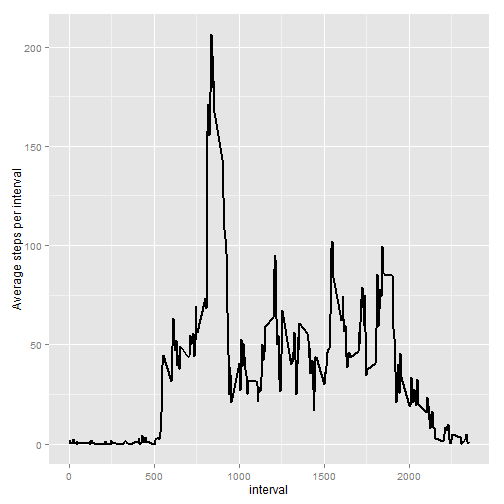
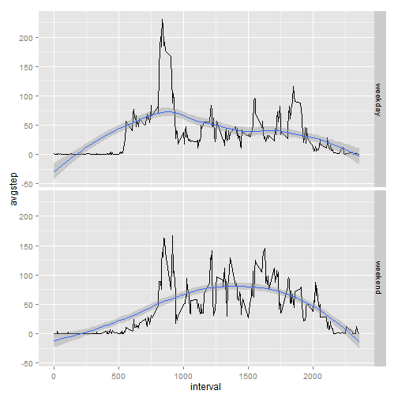

#Loading and preprocessing the data

Before we begin, let's download the nessesary packages and upload the data set
into the activity data frame. For my con·ven·ience I prefer to use the lubridate package to modify the date so it becomes easier to deal with in the future.


```r
library(ggplot2)
library(lubridate)
library(dplyr)
library(data.table)
activity <- read.csv("C:/Users/Eduardo/Desktop/Coursera/activity.csv")
activity$date <- ymd(activity$date)
```
#What is mean total number of steps taken per day?


```r
totalsteps <-summarize(group_by(activity, date), sum(steps))
colnames(totalsteps) <- c("date", "total")
```


```r
p <- ggplot(totalsteps , aes(x = date, y = total))
p + geom_histogram(stat ="identity" ,color = "white")
```

```
## Warning: Removed 8 rows containing missing values (position_stack).
```

 

```r
mean(totalsteps$total, na.rm = TRUE)
```

```
## [1] 10766.19
```

```r
median(totalsteps$total, na.rm = TRUE)
```

```
## [1] 10765
```

#What is the average daily activity pattern?

```r
avgint <-summarize(group_by(activity, interval), mean(steps, na.rm = TRUE))
colnames(avgint) <- c("interval", "avgsteps")
g <- ggplot(avgint, aes(x = interval, y = avgsteps))
g + geom_line(size = 1) + labs( y = "Average steps per interval")
```

 

#Imputing missing values

```r
sum(is.na(activity$steps))
```

```
## [1] 2304
```

```r
a<-data.table(activity,key="interval")
b<-data.table(avgint,key="interval")
c<-a[b][,steps:=ifelse(is.na(steps),avgsteps, steps)]
q <- ggplot(c , aes(x = date, y = steps))
q + geom_histogram(stat ="identity")
```

 

```r
d <-summarize(group_by(c, date), sum(steps))
setnames(d , c("date","sum(steps)"), c("date","total"))
mean( d$total)
```

```
## [1] 10766.19
```

```r
median(d$total)
```

```
## [1] 10766.19
```

Question 4. By putting the average number of steps instead of NA, you do not change the  new mean or median. The impact of puting in missing data values on is it increases the total amount of steps trhough out the dates. However it only increases periods that have NA values.

#Are there differences in activity patterns between weekdays and weekends?


```r
c$weekday <- weekdays(c$date)
c <- mutate(c, type = ifelse(weekday %in% c("Monday", "Tuesday", "Wednesday","Thursday", "Friday"), "weekday", 
                  ifelse(weekday %in% c("Saturday", "Sunday"),"weekend", NA)))
c$type <- as.factor(c$type)
c <- arrange(c , date)
c2 <- summarize(group_by(c, interval, type), avgstep = mean(steps, na.rm = TRUE))
qplot(interval, avgstep, data = c2, geom = c("line","smooth"), facets = type~.)
```

```
## geom_smooth: method="auto" and size of largest group is <1000, so using loess. Use 'method = x' to change the smoothing method.
## geom_smooth: method="auto" and size of largest group is <1000, so using loess. Use 'method = x' to change the smoothing method.
```

 


